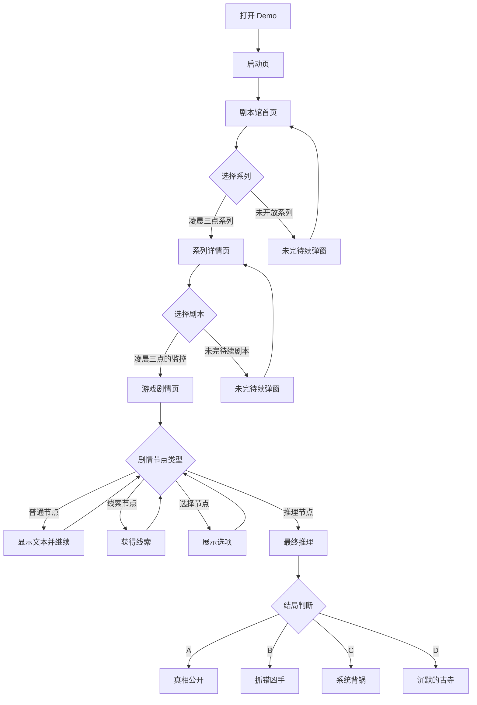

# 《迷雾剧本馆》软件产品 PRD

## 0. 文档信息

| 项目 | 内容 |
| --- | --- |
| 文档名称 | 《迷雾剧本馆》软件产品 PRD |
| 产品名称 | 迷雾剧本馆 |
| 文档版本 | v0.2 |
| 撰写日期 | 2026-06-30 |
| 当前阶段 | PRD 文档阶段 |
| 文档定位 | 软件产品 PRD，不是故事剧情 PRD |
| 适用范围 | 第一版前端 Demo 的产品形态、页面结构、功能模块、交互规则、数据结构、存档机制和验收标准 |
| 不包含内容 | 完整剧情对白、真实素材制作、后端设计、商业化后台 |

## 0.1 修订记录

| 版本 | 日期 | 修订说明 |
| --- | --- | --- |
| v0.1 | 2026-06-30 | 创建首版软件 PRD，明确 MVP 页面、系统、数据结构和验收标准 |
| v0.2 | 2026-06-30 | 按 PRD 工作流补充需求矩阵、业务流程、状态规则、数据协议、异常处理、测试验收和开发边界 |

## 1. 产品背景

悬疑推理视觉小说天然依赖“连续阅读、主动选择、证据收集、最终判断”的体验闭环。单篇故事 Demo 可以验证剧情，但无法验证系列化承载、剧本选择、未开放内容预期管理和多剧本扩展能力。

《迷雾剧本馆》的第一版目标不是做一个完整商业产品，而是搭建一个可靠的前端 Demo 外壳：用户能从剧本馆进入系列，再进入具体剧本，并在剧情中完成推进、选择、线索收集、存档读档、历史回看和多结局判断。

第一版应优先证明三件事：

1. 剧本馆作为内容入口是否清晰。
2. 悬疑视觉小说的核心互动链路是否完整。
3. 后续新增系列、剧本和剧情节点时，数据结构是否可扩展。

## 2. 产品定位

迷雾剧本馆是一个悬疑推理视觉小说剧本馆。用户进入后，先看到剧本馆外壳，再选择悬疑系列，再选择某一本剧本进入游玩。每个系列下面有多本剧本，第一版中“凌晨三点系列”已开放，第 1 本《凌晨三点的监控》可玩，第 2 本和第 3 本显示“未完待续”。

产品关键词：

| 关键词 | 解释 |
| --- | --- |
| 剧本馆 | 用系列和剧本组织内容，不只是单篇故事 |
| 悬疑推理 | 玩家需要根据证据链判断真相 |
| 视觉小说 | 以文本、角色、场景、选择和结局为主要体验 |
| 前端 Demo | 第一版不依赖后端，所有状态保存在浏览器本地 |
| 可扩展数据 | 系列、剧本、章节、节点、线索、结局均应数据化 |

## 3. 目标用户

| 用户类型 | 用户特征 | 核心场景 | 关键诉求 |
| --- | --- | --- | --- |
| 悬疑推理爱好者 | 喜欢案件、线索、反转、多结局 | 晚间碎片时间体验一段互动推理 | 线索公平、结局有因果、推理链说得通 |
| 视觉小说玩家 | 熟悉剧情推进、选择分支、回看历史 | 想快速进入故事并保存进度 | 阅读流畅、选项明确、可回看、可读档 |
| Demo 评审者 | 关注产品形态和开发可行性 | 检查 PRD 是否能指导开发 | 页面结构清晰、验收标准可测、数据结构可落地 |
| 内容创作者 | 后续可能扩写更多剧本 | 根据模板接入新故事 | 章节、节点、线索和结局规则稳定 |

## 4. 核心卖点

1. 剧本馆式内容入口：用“系列 > 剧本 > 章节”的结构承载多个悬疑故事。
2. 推理闭环：剧情推进、选择分支、线索收集、最终推理、结局反馈形成完整闭环。
3. 本地存档：无需登录，通过 localStorage 保存进度、存档槽、线索和历史。
4. 未开放内容管理：第二本、第三本和其他系列可展示但不可进入，提前建立系列感。
5. 数据驱动扩展：第一版就为后续新增剧本预留统一数据字段。

## 5. 产品目标与成功标准

| 目标类型 | 目标 | 衡量方式 |
| --- | --- | --- |
| 产品目标 | 建立可运行的悬疑剧本馆前端 Demo 外壳 | 用户可完成从首页到结局的完整流程 |
| 体验目标 | 让用户理解当前开放内容和未开放内容 | 用户点击未开放内容时有明确提示，不误以为故障 |
| 推理目标 | 让《凌晨三点的监控》具备基本推理可玩性 | 至少 5 条线索可收集，至少 4 个结局可触发 |
| 技术目标 | 不依赖后端即可保存进度 | 刷新页面后可恢复本地进度或读取存档 |
| 扩展目标 | 新增剧本时不重写核心逻辑 | 通过剧本数据结构新增系列、剧本、节点和结局 |

## 6. MVP 范围

| 展现形式 | 功能模块 | 功能名称 | 功能描述 | 优先级 | 备注 |
| --- | --- | --- | --- | --- | --- |
| Web 端 | 入口体验 | 启动页 | 展示产品氛围和进入入口 | P0 | 第一屏，不做登录 |
| Web 端 | 内容浏览 | 剧本馆首页 | 展示系列列表、开放状态、进入入口 | P0 | 三个系列 |
| Web 端 | 内容浏览 | 系列详情页 | 展示系列说明和剧本列表 | P0 | 凌晨三点系列可进入 |
| Web 端 | 剧情播放 | 游戏剧情页 | 支持文本推进、角色/旁白展示、选项分支 | P0 | 第一版核心体验 |
| Web 端 | 推理系统 | 线索收集 | 到达指定节点自动获得线索，可在弹窗查看 | P0 | 影响结局判断 |
| Web 端 | 推理系统 | 最终推理 | 根据线索和选择触发 A/B/C/D 结局 | P0 | 与故事 PRD 对齐 |
| Web 端 | 本地状态 | 自动进度 | 保存当前剧本、章节、节点、线索和标记 | P0 | localStorage |
| Web 端 | 本地状态 | 存档/读档 | 支持 3 个手动存档槽 | P1 | 读档前确认 |
| Web 端 | 阅读辅助 | 历史记录 | 展示已阅读文本和已选选项 | P1 | 支持推理回看 |
| Web 端 | 内容状态 | 未完待续提示 | 点击未开放系列或剧本时弹窗提示 | P0 | 不跳转 |
| Web 端 | 视觉占位 | 占位图/场景占位 | 使用占位区域表达场景，不接真实素材 | P1 | 不生成图片 |

## 7. 非 MVP 范围

1. 不做后端服务。
2. 不做用户注册、登录、账号体系。
3. 不做支付、订阅、会员、兑换码。
4. 不做后台管理、剧情编辑器、运营配置台。
5. 不接真实图片、音频、视频或 AI 素材。
6. 不使用 React、Vue、Angular 等前端框架。
7. 不做多人互动、排行、评论、分享。
8. 不做云端存档同步。
9. 不做完整商业化埋点，只保留本地调试可观察性。

## 8. 内容范围

### 8.1 第一版系列

| 系列 ID | 系列名称 | 状态 | 首版行为 |
| --- | --- | --- | --- |
| series_3am | 凌晨三点系列 | 已开放 | 可进入系列详情页 |
| series_rain_call | 雨夜来电系列 | 未开放 | 点击展示未完待续 |
| series_old_building | 旧楼档案系列 | 未开放 | 点击展示未完待续 |

### 8.2 凌晨三点系列剧本

| 剧本 ID | 剧本名称 | 状态 | 首版行为 |
| --- | --- | --- | --- |
| script_3am_monitor | 《凌晨三点的监控》 | 已开放 | 可进入游戏剧情页 |
| script_3am_call | 《凌晨三点的来电》 | 未完待续 | 点击展示未完待续 |
| script_3am_empty_room | 《凌晨三点的空房间》 | 未完待续 | 点击展示未完待续 |

## 9. 信息架构

```text
迷雾剧本馆
├─ 启动页
├─ 剧本馆首页
│  ├─ 系列卡片：凌晨三点系列（已开放）
│  ├─ 系列卡片：雨夜来电系列（未开放）
│  └─ 系列卡片：旧楼档案系列（未开放）
├─ 系列详情页：凌晨三点系列
│  ├─ 剧本卡片：《凌晨三点的监控》（已开放）
│  ├─ 剧本卡片：《凌晨三点的来电》（未完待续）
│  └─ 剧本卡片：《凌晨三点的空房间》（未完待续）
└─ 游戏剧情页：《凌晨三点的监控》
   ├─ 顶部状态栏
   ├─ 场景占位区
   ├─ 角色/旁白区
   ├─ 剧情文本区
   ├─ 选项区
   ├─ 工具栏
   ├─ 线索弹窗
   ├─ 存档/读档弹窗
   ├─ 历史记录弹窗
   └─ 结局展示
```

## 10. 主业务流程



## 11. 页面流程与状态

| 页面 | 初始状态 | 主要操作 | 退出路径 | 异常状态 |
| --- | --- | --- | --- | --- |
| 启动页 | 展示产品名、进入按钮 | 点击进入 | 剧本馆首页 | 无 |
| 剧本馆首页 | 展示系列列表 | 选择系列 | 系列详情页或未完待续弹窗 | 系列数据为空时展示空状态 |
| 系列详情页 | 展示剧本列表 | 选择剧本、返回首页 | 游戏剧情页或首页 | 剧本数据为空时展示空状态 |
| 游戏剧情页 | 加载剧本首节点或存档节点 | 继续、选择、存档、读档、查看线索、查看历史 | 结局页或返回系列 | 节点缺失时提示数据错误 |
| 线索弹窗 | 展示已获得线索 | 查看详情、关闭 | 回到游戏剧情页 | 无线索时展示空提示 |
| 存档/读档弹窗 | 展示存档槽 | 保存、读取、覆盖确认 | 回到游戏剧情页 | 存档损坏时提示不可读取 |
| 历史记录弹窗 | 展示阅读历史 | 滚动查看、关闭 | 回到游戏剧情页 | 无历史时展示空提示 |
| 未完待续弹窗 | 展示未开放内容名 | 确认关闭 | 回到原页面 | 无 |

## 12. 页面功能说明

### 12.1 启动页

| 项目 | 说明 |
| --- | --- |
| 页面目标 | 建立悬疑氛围，提供进入剧本馆的唯一主入口 |
| 核心元素 | 产品名、短副标题、进入按钮、版本/阶段提示 |
| 交互规则 | 点击进入按钮后跳转剧本馆首页 |
| 验收标准 | 页面加载后不需要登录即可进入首页 |

### 12.2 剧本馆首页

| 项目 | 说明 |
| --- | --- |
| 页面目标 | 让用户理解当前有哪些悬疑系列，以及哪些已开放 |
| 核心元素 | 系列卡片、开放状态、系列简介、返回/继续游玩入口 |
| 交互规则 | 已开放系列可进入，未开放系列弹出未完待续 |
| 状态规则 | 已开放、未开放两类状态必须视觉上可区分 |
| 验收标准 | 三个系列均可见，点击行为符合状态 |

### 12.3 系列详情页

| 项目 | 说明 |
| --- | --- |
| 页面目标 | 展示“凌晨三点系列”下的剧本列表 |
| 核心元素 | 系列名、系列简介、剧本卡片、剧本状态、返回首页 |
| 交互规则 | 第 1 本可进入剧情页，第 2/3 本展示未完待续 |
| 状态规则 | 未完待续剧本不可进入剧情页 |
| 验收标准 | 三本剧本均显示，状态和点击反馈正确 |

### 12.4 游戏剧情页

| 项目 | 说明 |
| --- | --- |
| 页面目标 | 承载视觉小说的主要游玩体验 |
| 核心元素 | 剧本名、章节名、场景占位、角色名、文本、选项、工具栏 |
| 交互规则 | 普通节点可继续，选择节点必须选择后继续，结局节点展示结局 |
| 状态规则 | 当前节点、已得线索、历史、分支变量需同步写入本地进度 |
| 验收标准 | 可从开局走到至少一个结局，且刷新后进度可恢复 |

## 13. 剧情播放规则

| 节点类型 | 显示内容 | 用户操作 | 系统动作 |
| --- | --- | --- | --- |
| dialogue | 角色名/旁白、文本 | 点击继续 | 跳转 nextNodeId |
| choice | 文本、选项列表 | 点击一个选项 | 写入 flags，跳转选项 nextNodeId |
| clue | 文本、线索提示 | 点击继续或查看线索 | 写入 collectedClues |
| deduction | 推理题、证据选项 | 选择答案 | 更新 deductionScore 或结局变量 |
| ending | 结局名、结局说明 | 返回首页/重开 | 结束当前剧本流程 |

规则要求：

1. 如果节点同时包含 `text` 和 `choices`，应先显示文本，再展示选项。
2. 选择节点没有默认选项，用户必须主动选择。
3. 重复获得同一线索时不重复插入，只可刷新获得时间或保持原记录。
4. 结局节点不再自动推进。

## 14. 线索系统设计

### 14.1 线索字段

| 字段 | 类型 | 必填 | 说明 |
| --- | --- | --- | --- |
| clueId | string | 是 | 线索唯一 ID |
| title | string | 是 | 线索名称 |
| description | string | 是 | 线索描述 |
| category | string | 是 | 监控、现场、证词、系统日志、旧案 |
| chapterId | string | 是 | 首次出现章节 |
| nodeId | string | 是 | 首次出现节点 |
| isKey | boolean | 是 | 是否关键线索 |
| truthTags | array | 否 | 对应真相环节，例如 fake_locked_room |

### 14.2 线索获得规则

1. 节点配置 `gainClues` 后，玩家到达节点即获得线索。
2. 系统用 `clueId` 去重。
3. 获得新线索时显示短提示。
4. 线索弹窗按分类展示。
5. 关键线索参与最终推理和结局判断。

### 14.3 首版关键线索

| clueId | 线索名称 | 分类 | 是否关键 |
| --- | --- | --- | --- |
| clue_lost_7_seconds | 第三路监控丢失 7 秒 | 系统日志 | 是 |
| clue_lock_scratch | 门锁内侧有划痕 | 现场 | 是 |
| clue_water_trace | 钟楼地面有水痕 | 现场 | 是 |
| clue_broadcast_0317 | 广播系统在 03:17 启动过 | 系统日志 | 是 |
| clue_tang_login | 唐越账号案发前登录过后台 | 系统日志 | 是 |
| clue_old_account | 死者调查过 7 年前旧账 | 旧案 | 是 |
| clue_prerecorded_video | 后殿监控画面存在预录痕迹 | 监控 | 是 |

## 15. 存档/读档系统设计

### 15.1 存档槽

第一版提供 3 个手动存档槽，另保留 1 个自动进度。

| 类型 | Key | 数量 | 用途 |
| --- | --- | --- | --- |
| 自动进度 | mist.currentProgress | 1 | 刷新后继续最近游玩 |
| 手动存档 | mist.saveSlots | 3 | 玩家主动保存和读取 |

### 15.2 存档内容

| 字段 | 类型 | 说明 |
| --- | --- | --- |
| saveId | string | 存档槽 ID |
| scriptId | string | 剧本 ID |
| chapterId | string | 当前章节 ID |
| nodeId | string | 当前节点 ID |
| collectedClues | array | 已获得线索 ID |
| flags | object | 已触发分支变量 |
| history | array | 当前历史记录 |
| endingId | string/null | 已触发结局 |
| savedAt | string | ISO 时间 |
| summary | string | 存档摘要，用于槽位展示 |

### 15.3 交互规则

1. 保存空槽位时直接写入。
2. 覆盖已有槽位前弹出二次确认。
3. 读取槽位前提示会覆盖当前临时进度。
4. 读取损坏或版本不兼容存档时提示“存档不可读取”，不改变当前状态。
5. 自动进度在节点变更、获得线索、完成选择后更新。

## 16. 历史记录设计

| 字段 | 类型 | 说明 |
| --- | --- | --- |
| recordId | string | 历史记录 ID |
| nodeId | string | 来源节点 |
| chapterId | string | 来源章节 |
| speaker | string | 角色名或旁白 |
| text | string | 已展示文本 |
| choiceText | string/null | 玩家选择内容 |
| createdAt | string | 记录时间 |

规则：

1. 普通剧情文本进入历史记录。
2. 玩家选择也进入历史记录，并标记为“玩家选择”。
3. 系统提示、存档成功提示、未完待续提示不进入历史。
4. 历史记录按时间正序展示。
5. 读档后恢复存档中的历史记录。

## 17. 未完待续机制

| 触发对象 | 示例 | 行为 |
| --- | --- | --- |
| 未开放系列 | 雨夜来电系列、旧楼档案系列 | 留在首页，打开弹窗 |
| 未开放剧本 | 《凌晨三点的来电》《凌晨三点的空房间》 | 留在系列详情页，打开弹窗 |
| 后续章节占位 | 如后续扩展未完成章节 | 留在当前页，打开弹窗 |

弹窗文案建议：

```text
《内容名称》仍在整理中。
请先体验已开放剧本：《凌晨三点的监控》。
```

## 18. 数据结构建议

### 18.1 系列数据

```json
{
  "seriesId": "series_3am",
  "title": "凌晨三点系列",
  "status": "open",
  "summary": "围绕凌晨三点发生的技术异常与现实案件展开的悬疑系列。",
  "scriptIds": ["script_3am_monitor", "script_3am_call", "script_3am_empty_room"]
}
```

### 18.2 剧本数据

```json
{
  "scriptId": "script_3am_monitor",
  "seriesId": "series_3am",
  "title": "凌晨三点的监控",
  "status": "open",
  "order": 1,
  "summary": "古寺智能监控上线前夜发生的密室死亡事件。",
  "coverPlaceholder": "placeholder_monitor",
  "startNodeId": "n_001",
  "chapters": ["chapter_01", "chapter_02", "chapter_03", "chapter_04", "chapter_05", "chapter_06"],
  "endings": ["ending_a", "ending_b", "ending_c", "ending_d"]
}
```

### 18.3 剧情节点数据

```json
{
  "nodeId": "n_001",
  "chapterId": "chapter_01",
  "type": "dialogue",
  "speaker": "林澈",
  "text": "这里放剧情文本摘要或正式文本。",
  "scene": "temple_monitor_room",
  "gainClues": ["clue_lost_7_seconds"],
  "setFlags": ["found_lost_7_seconds"],
  "nextNodeId": "n_002",
  "choices": [
    {
      "choiceId": "c_check_log",
      "text": "先检查系统日志",
      "nextNodeId": "n_010",
      "setFlags": ["checked_log_first"]
    }
  ],
  "endingId": null
}
```

### 18.4 结局判断数据

```json
{
  "endingId": "ending_a",
  "title": "真相公开",
  "requiredClues": [
    "clue_lost_7_seconds",
    "clue_lock_scratch",
    "clue_broadcast_0317",
    "clue_old_account",
    "clue_prerecorded_video"
  ],
  "requiredFlags": ["chose_public_truth"],
  "priority": 1
}
```

## 19. localStorage 字段建议

| Key | 数据类型 | 内容 | 写入时机 |
| --- | --- | --- | --- |
| mist.currentProgress | object | 当前自动进度 | 节点变化、选择、获得线索、结局触发 |
| mist.saveSlots | array | 3 个手动存档槽 | 玩家手动保存 |
| mist.history | array | 当前游玩历史记录 | 文本展示、选择完成 |
| mist.settings | object | 本地设置预留 | 设置变化 |
| mist.schemaVersion | string | 本地数据版本 | 初始化或版本升级 |

建议首版 `schemaVersion` 使用 `0.2`。读取时若版本缺失，按兼容旧数据处理；若版本不兼容，提示用户清空本地进度或重新开始。

## 20. UI 风格说明

1. 整体风格：悬疑、冷静、档案感、夜间监控感。
2. 色彩方向：深色背景，低饱和灰蓝为主，暗红或警示黄作为少量强调色。
3. 字体方向：标题可以更具电影感，正文优先保证长文本阅读舒适。
4. 页面气质：克制，不用夸张惊吓视觉，不依赖真实图片。
5. 组件密度：剧情页工具按钮清晰可见，但不能干扰阅读。
6. 占位图策略：用场景名、色块、监控框或档案框表达占位，不生成真实图片。

## 21. 交互规则

| 场景 | 规则 |
| --- | --- |
| 点击已开放系列 | 进入系列详情页 |
| 点击未开放系列 | 打开未完待续弹窗，不跳转 |
| 点击已开放剧本 | 进入游戏剧情页 |
| 点击未完待续剧本 | 打开未完待续弹窗，不跳转 |
| 普通剧情节点 | 点击继续后进入 nextNodeId |
| 选择节点 | 必须选择一个选项，不能直接继续 |
| 获得线索 | 展示提示并写入线索列表 |
| 存档覆盖 | 必须二次确认 |
| 读档 | 必须确认会覆盖当前临时进度 |
| 弹窗打开 | 背景主操作不可点击 |
| localStorage 写入失败 | 展示提示，允许继续当前会话 |

## 22. 异常处理

| 异常 | 触发条件 | 系统响应 |
| --- | --- | --- |
| 剧本数据缺失 | scriptId 找不到 | 展示“剧本数据暂不可用”，返回系列页 |
| 节点缺失 | nodeId 找不到 | 展示“剧情节点异常”，允许返回首页 |
| 存档损坏 | JSON 解析失败或字段缺失 | 提示不可读取，不覆盖当前进度 |
| localStorage 不可用 | 浏览器禁用或容量不足 | 提示无法保存，但允许继续游玩 |
| 结局条件冲突 | 多个结局同时满足 | 按 ending priority 取优先级最高 |

## 23. 第一版验收标准

| 编号 | 验收项 | 验收方式 |
| --- | --- | --- |
| AC-01 | 打开 Demo 后能从启动页进入剧本馆首页 | 手动测试 |
| AC-02 | 首页展示三个系列及开放状态 | 手动测试 |
| AC-03 | 点击“凌晨三点系列”进入系列详情页 | 手动测试 |
| AC-04 | 点击未开放系列展示未完待续弹窗 | 手动测试 |
| AC-05 | 系列详情页展示三本剧本及状态 | 手动测试 |
| AC-06 | 点击《凌晨三点的监控》进入剧情页 | 手动测试 |
| AC-07 | 点击第 2/3 本剧本展示未完待续弹窗 | 手动测试 |
| AC-08 | 剧情页可推进普通节点 | 手动测试 |
| AC-09 | 至少一个选择节点可改变后续节点或变量 | 手动测试 |
| AC-10 | 至少 5 条线索可获得并在弹窗查看 | 手动测试 |
| AC-11 | 历史记录可展示已阅读文本和已选选项 | 手动测试 |
| AC-12 | 可保存到 3 个本地存档槽之一 | 手动测试 |
| AC-13 | 可读取存档并恢复对应节点、线索和历史 | 手动测试 |
| AC-14 | 最终推理可触发 A/B/C/D 四类结局之一 | 手动测试 |
| AC-15 | 刷新页面后自动进度或存档不丢失 | 手动测试 |
| AC-16 | 项目不包含后端、登录、支付、后台管理和真实素材依赖 | 文件检查 |

## 24. 开发拆分建议

| 阶段 | 交付内容 | 说明 |
| --- | --- | --- |
| D1 | 静态页面骨架 | 启动页、首页、系列详情页、剧情页基础结构 |
| D2 | 数据结构与路由状态 | 系列、剧本、章节、节点数据读取与页面切换 |
| D3 | 剧情播放器 | 普通节点、选择节点、线索节点、结局节点 |
| D4 | 本地系统 | localStorage、自动进度、存档读档、历史记录 |
| D5 | 结局与验收 | 最终推理、四结局、异常处理、验收测试 |

## 25. 后续迭代方向

1. 增加真实视觉素材、音效和背景音乐。
2. 增加结局图鉴、线索图谱、成就系统。
3. 增加剧情数据编辑器或轻量 JSON 配置规范。
4. 增加更多系列和剧本。
5. 增加移动端适配和 PWA 支持。
6. 增加账号体系和云端存档。
7. 增加章节解锁、付费内容和运营后台。

## 26. 风险点

| 风险 | 可能影响 | 等级 | 应对 |
| --- | --- | --- | --- |
| 剧情数据结构过复杂 | 第一版开发成本上升 | 中 | MVP 只保留必要字段 |
| 结局判断不透明 | 玩家觉得结局不公平 | 高 | 故事 PRD 明确线索和结局映射 |
| localStorage 数据损坏 | 用户无法读档 | 中 | 读取时校验字段，失败不覆盖当前状态 |
| 未开放内容过多 | 用户误以为 Demo 半成品 | 中 | 明确状态标签和弹窗说明 |
| 无真实素材 | 氛围弱 | 中 | 用版式、文字、占位场景和监控感 UI 补足 |
| 剧情文本后续膨胀 | 节点维护困难 | 中 | 早期统一 nodeId、chapterId、clueId 命名 |

## 27. 开发前待确认问题

1. 第一版是否按桌面端优先，移动端只做基础适配？
2. 剧情体验时长是否控制在 15-30 分钟？
3. 存档槽数量是否固定为 3 个？
4. 自动进度是否在每个节点都保存，还是只在章节和选择后保存？
5. 最终推理失败后是否允许立即重试？
6. 结局达成后是否提供“重新开始”和“读取存档”两个入口？
7. 历史记录是否需要跨结局保存，还是随存档恢复？
8. 第一版是否需要键盘操作，例如空格推进、Esc 关闭弹窗？
9. 是否需要在 UI 中展示“文档阶段 Demo，非最终内容”的说明？
